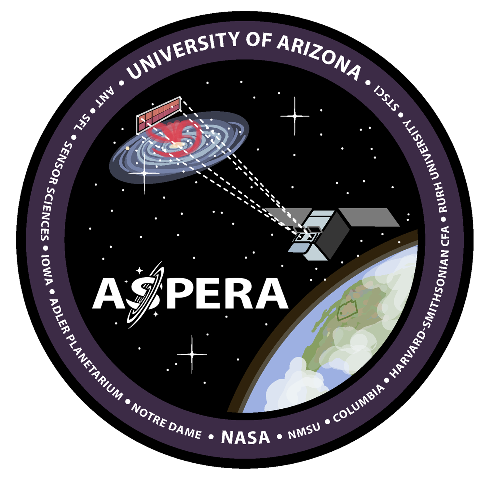
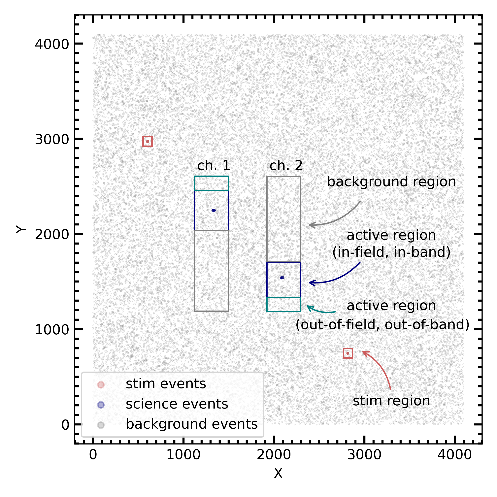
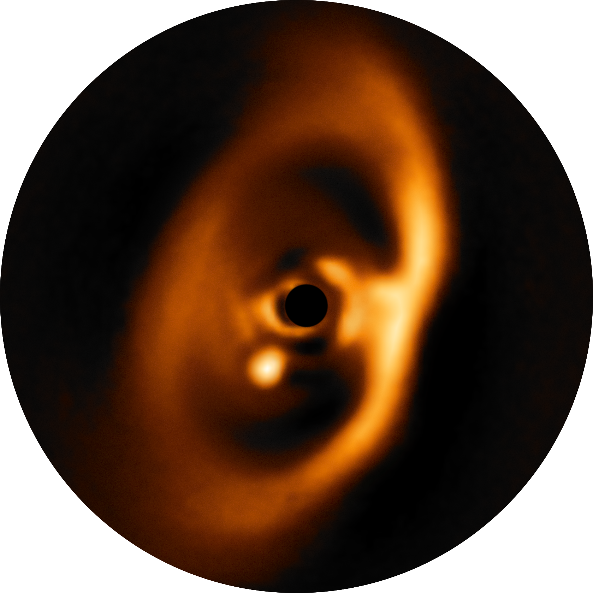

#### Developing a data processing pipeline for Aspera

::: columns

::: {.column width="70%"}
Aspera is a NASA-funded UV SmallSat Mission in development with a projected launch in 2025.
The goal of the mission is to detect and map gas in the vicinity of nearby galaxies through spectroscopic observations in the UV wavelength range.
The instrument consists of two parallel long-slit spectrographs that will allow to sample the spatial distribution of gas by placing the slits at different fields around a target galaxy in a subsequent manner.
I am leading the development of a data processing pipeline for Aspera that will calibrate individual observations, and subsequently reconstruct a three-dimensional hyperspectral data cube by combining all observations obtained for each of our target galaxies.
The data products exported by the pipeline will be made publicly available through the Barbara Mikulski Archive for Space Telescopes (MAST).
A publication with an overview of the pipeline design is currently in press.
:::

::: {.column width="30%"}
{height="300px" fig-align="center"}
:::
:::

#### Designing an instrument simulator for Aspera

::: columns

::: {.column width="30%"}
{width=90% fig-align="center"}
:::

::: {.column width="70%"}
In order to be optimally prepared for possible extreme-case scenarios that may occur during flight and that the data processing pipeline might be confronted with when being executed in real-time, it is important to test the pipeline in an extensive manner.
To that goal, I am developing together with students a software instrument simulator that generates mock
observations for Aspera.
The instrument simulator allows to place a slit at any desired location around a simulated galaxy, and generates raw observation files taking into account the main optical behaviour of the system which are then used to test the pipeline.
This tool can thus be used to generate mock data assuming various
different observing conditions and instrument performance, and help us to test the pipeline at the limits of its capabilities.
:::

:::

#### Analysing terrestrial airglow emission with archival space-based observations

::: columns

::: {.column width="60%"}
Space-borne observations operating in far-UV wavelength regime are often affected by contaminant foreground emission, in particular during day time. These emission lines are usually generated by solar, high-energetic UV and X-ray photons, causing resonant scattering of solar emission lines and stimulated fluorescent emission by photoelectrons when impacting the upper layers of Earth's atmosphere.
With several UV astrophysics missions in development or in the planning (e.g., Aspera, UVEX, HWO), characterizing the strength of the most prominent of these emission lines will help to better predict their impact on past, current and future FUV space missions.
I am analysing geocoronal foreground emission lines from the archival data of FUSE (Far-Ultraviolet Spectroscopic Explorer), a Medium-size Explorer class mission that operated between 1999 and 2007 at far-UV wavelengths. The goal of this work is to establish a model that may allow to predict airglow line strenghts as a function various spacecraft, orbital, atmospheric and solar parameters.
:::

::: {.column width="40%"}
{width=95% fig-align="center"}
:::
:::

#### Tracing planet formation with multi-wavelength observations
::: columns

::: {.column width="35%"}
{width=90% fig-align="center"}
:::

::: {.column width="65%"}
Planets are formed within structures of dust and gas surrounding newly born stars, so-called protoplanetary disks.
During my PhD, I have focused on the observations of direct and indirect traces of planet formation outside of our Solar System. To this goal, I have employed observations of protoplanetary disks with various different techniques (e.g., imaging, polarimetry, spectroscopy, interferometry) at multiple different wavelengths from the optical to the sub-millimeter regime.
In 2018, our group has detected the [first bona-fide direct image of a forming planet](https://www.eso.org/public/news/eso1821/) within its parental protoplanetary disk, PDS 70 b. In a [follow-up work]{https://arxiv.org/abs/1902.07639}, we have investigated the disk structure and kinematics of the protoplanetary system PDS 70 using sub-millimeter interferometric observations. In addition, we have studied the [highly structured dust disk](https://www.aanda.org/2020-highlights/1868-gap-shadows-spirals-and-streamers-sphere-observations-of-binary-disk-interactions-in-gg-tauri-a-keppler-et-al) at high spatial resolution around a multiple star system called GG Tau A.
:::
:::